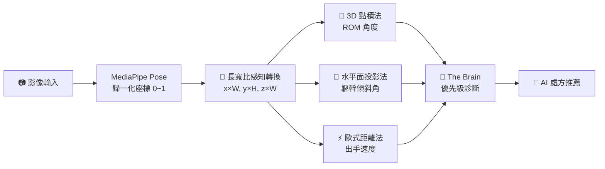

# 關鍵演算法公式 — AI 3D 骨架追蹤復健分析系統

> 本文件供專利事務所撰寫說明書使用
> 原始碼位置：[BocciaCam.tsx](file:///c:/Users/secre/.gemini/antigravity/scratch/floor-curling-app/components/ai/BocciaCam.tsx)

---

## 一、使用的骨架節點 (MediaPipe Pose Landmark IDs)

| 節點 ID | 名稱 | 用途 |
|---------|------|------|
| **11** | 左肩 (LEFT_SHOULDER) | 軀幹傾斜計算 |
| **12** | 右肩 (RIGHT_SHOULDER) | 軀幹傾斜 + ROM 起點 |
| **13** | 左肘 (LEFT_ELBOW) | — |
| **14** | 右肘 (RIGHT_ELBOW) | ROM 頂點（角度量測中心）|
| **15** | 左腕 (LEFT_WRIST) | — |
| **16** | 右腕 (RIGHT_WRIST) | ROM 終點 + 速度追蹤 |
| **23** | 左髖 (LEFT_HIP) | 骨架繪製 |
| **24** | 右髖 (RIGHT_HIP) | 骨架繪製 |

每個節點由 MediaPipe 輸出 **四維資料**：

$$
\text{Landmark} = (x,\ y,\ z,\ \text{visibility})
$$

- $x, y$：歸一化螢幕座標 $\in [0, 1]$
- $z$：深度座標（以髖部中點為原點，與 $x$ 同尺度）
- $\text{visibility}$：可見度信心值 $\in [0, 1]$

---

## 二、專利核心前置處理：長寬比感知座標轉換 (Aspect-Ratio Aware)

### 技術問題

手機直式拍攝（Portrait Mode）的標準長寬比為 **9:16**（例如 1080×1920 像素）。MediaPipe 輸出歸一化座標 $\in [0, 1]$，但直式畫面中：

- X 軸代表較**窄**的物理寬度（如 1080 px）
- Y 軸代表較**長**的物理高度（如 1920 px）

若直接使用歸一化座標計算角度，等效於對 X 軸施加了一個 $\frac{9}{16} \approx 0.5625$ 的壓縮係數，導致：

> **實際傾斜 20° 的軀幹，系統僅計算出 8°~9°，永遠無法觸發 >15° 的跌倒警示閾值。**

### 解決方案：像素座標還原

在所有角度與速度計算之前，**強制**將歸一化座標轉換為真實像素座標：

$$
X_{real} = x_{MediaPipe} \times W_{image}
$$

$$
Y_{real} = y_{MediaPipe} \times H_{image}
$$

$$
Z_{real} = z_{MediaPipe} \times W_{image}
$$

其中 $W_{image}$ 和 $H_{image}$ 為攝影機的實際解析度（如直式 $W=1080, H=1920$）。

> **Z 軸乘以 $W_{image}$ 而非 $H_{image}$**：根據 Google MediaPipe 技術文件，$z$ 座標與 $x$ 座標使用相同的物理尺度。

### 數學證明（為何必須還原）

以軀幹傾斜角為例，假設真實物理世界中左右肩膀有 $\Delta y = 100$ px 的高低差，$\Delta x = 200$ px 的水平距離。

**未還原（直接使用歸一化座標，直式 1080×1920）**：

$$
\Delta y_{norm} = \frac{100}{1920} \approx 0.052 \qquad \Delta x_{norm} = \frac{200}{1080} \approx 0.185
$$

$$
\theta_{wrong} = \arctan\!\left(\frac{0.052}{0.185}\right) \approx 15.7°
$$

**已還原（使用真實像素）**：

$$
\theta_{correct} = \arctan\!\left(\frac{100}{200}\right) = 26.6°
$$

> 差異高達 **10.9°**，足以導致跌倒警示的假陰性（未發出應有的警告）。

### 技術優勢

| 項目 | 未還原 | 本專利方法 |
|------|------|---------|
| 直式 9:16 角度誤差 | 壓縮 ~44% | ✅ 零誤差 |
| 橫式 16:9 角度誤差 | 拉伸 ~78% | ✅ 零誤差 |
| 跨裝置一致性 | ❌ 依賴畫面比例 | ✅ 裝置無關 |
| 臨床閾值可靠性 | ❌ 不可靠 | ✅ 精準對應真實角度 |

---

## 三、指標 A：手肘伸展度 ROM（3D 點積法）

### 目的
量測「**肩膀 → 肘部 → 手腕**」三點的真實空間夾角，判斷手臂是否完全伸展。

### 使用節點
- $A$ = 右肩 (ID: 12)
- $B$ = 右肘 (ID: 14)　← 角度頂點
- $C$ = 右腕 (ID: 16)

> ⚠️ 所有座標均須先經過**第二節「長寬比感知轉換」**還原為真實像素後再計算。

### 公式

**步驟 1**：建立 3D 向量（使用還原後像素座標）

$$
\vec{BA} = A_{real} - B_{real} = (A_x - B_x,\ A_y - B_y,\ A_z - B_z)
$$

$$
\vec{BC} = C_{real} - B_{real} = (C_x - B_x,\ C_y - B_y,\ C_z - B_z)
$$

**步驟 2**：計算點積與向量長度

$$
\vec{BA} \cdot \vec{BC} = BA_x \cdot BC_x + BA_y \cdot BC_y + BA_z \cdot BC_z
$$

$$
|\vec{BA}| = \sqrt{BA_x^2 + BA_y^2 + BA_z^2}
$$

$$
|\vec{BC}| = \sqrt{BC_x^2 + BC_y^2 + BC_z^2}
$$

**步驟 3**：求解夾角

$$
\theta_{ROM} = \cos^{-1}\!\left(\frac{\vec{BA} \cdot \vec{BC}}{|\vec{BA}| \times |\vec{BC}|}\right) \times \frac{180°}{\pi}
$$

### 臨床閾值

| 狀態 | 條件 | 意義 |
|------|------|------|
| ✅ 手臂完全伸展 | $\theta_{ROM} \geq 160°$ | 正常活動範圍 |
| ⚠️ 伸展受限 | $\theta_{ROM} < 160°$ | 可能肌肉張力過高 (Spasticity) |

### 技術優勢
> 傳統 2D 方法使用 $\text{atan2}$ 差值，在鏡頭有角度時會產生投影誤差。
> **本 3D 點積法直接在空間中計算夾角，完全排除鏡頭視角干擾。**

---

## 四、指標 B：軀幹穩定度（3D 水平面投影法）

### 目的
量測「**左右肩膀連線**」相對於水平面的真實傾斜角度，偵測跌倒風險。

### 使用節點
- $A$ = 左肩 (ID: 11)
- $B$ = 右肩 (ID: 12)

> ⚠️ 所有座標均須先經過**第二節「長寬比感知轉換」**還原為真實像素後再計算。

### 公式

**步驟 1**：計算肩膀連線的 3D 方向向量（像素級）

$$
\Delta x = B_{x,real} - A_{x,real} \quad,\quad \Delta y = B_{y,real} - A_{y,real} \quad,\quad \Delta z = B_{z,real} - A_{z,real}
$$

**步驟 2**：計算水平面上的投影長度

$$
L_{horizontal} = \sqrt{\Delta x^2 + \Delta z^2}
$$

> $L_{horizontal}$ 是肩膀連線在「**x-z 水平面**」上的投影，排除了鏡頭深度角度造成的假陽性。

**步驟 3**：求解傾斜角

$$
\theta_{tilt} = \left|\arctan\!\left(\frac{\Delta y}{L_{horizontal}}\right)\right| \times \frac{180°}{\pi}
$$

### 臨床閾值

| 狀態 | 條件 | 意義 |
|------|------|------|
| ✅ 軀幹穩定 | $\theta_{tilt} \leq 15°$ | 安全範圍 |
| ⚠️ 跌倒風險 | $\theta_{tilt} > 15°$ | 身體明顯傾斜 (Fall Risk) |

### 技術優勢
> 傳統 2D 方法使用 $\text{atan2}(\Delta y, \Delta x)$，當鏡頭從側面拍攝（$z$ 軸差異大）時，
> 會將深度差異誤判為左右傾斜。
> **本方法使用 x-z 平面投影 + 長寬比還原，僅量測真實的垂直傾斜分量。**

---

## 五、指標 C：出手速度（3D 歐式距離法 + 對角線歸一化）

### 目的
追蹤手腕在連續幀之間的 3D 位移速度，反映投球的爆發力。

### 使用節點
- $W_t$ = 右腕在當前幀 (ID: 16)
- $W_{t-1}$ = 右腕在前一幀 (ID: 16)

> ⚠️ 所有座標均須先經過**第二節「長寬比感知轉換」**還原為真實像素後再計算。

### 公式

**步驟 1**：計算 3D 位移距離（像素級）

$$
d_{3D} = \sqrt{(W_{t,x} - W_{t-1,x})^2 + (W_{t,y} - W_{t-1,y})^2 + (W_{t,z} - W_{t-1,z})^2}
$$

**步驟 2**：計算對角線長度（消除不同解析度的影響）

$$
D_{diagonal} = \sqrt{W_{image}^2 + H_{image}^2}
$$

**步驟 3**：歸一化速度

$$
V = \text{round}\!\left(\frac{d_{3D}}{D_{diagonal} \times \Delta t} \times 100\right)
$$

> 除以對角線長度 $D_{diagonal}$ 可確保不同解析度的裝置（如 720p vs 1080p）計算出一致的速度值。

### 臨床閾值

| 狀態 | 條件 | 意義 |
|------|------|------|
| ✅ 發力充足 | $V > 50$ | 具備良好爆發力 |
| ⚠️ 速度偏慢 | $V < 30$ | 建議爆發力訓練 |

### 技術優勢
> 2D 方法僅計算螢幕平面的位移，忽略了手腕「向前推出」(z 軸) 的運動。
> **3D 距離 + 對角線歸一化，同時解決了深度運動遺失與裝置解析度差異問題。**

---

## 六、The Brain — 優先級診斷規則引擎

```
IF  θ_tilt > 15°     → ⚠️ 核心穩定度警示 (Fall Risk)
ELIF θ_ROM < 160°     → 💪 上肢伸展受限 (Spasticity)
ELIF V < 30           → ⚡ 發力速度偏慢
ELIF ROM≥160 & V>50   → ✅ 動作表現優異
ELSE                  → 🔵 動作穩定，準備投球
```

> 規則按**安全性 → 功能性 → 表現性**的臨床優先級排列，
> 確保系統優先通報最危急的狀況。

---

## 七、安全降級機制

所有 3D 公式使用 `(z || 0)` 容錯設計：

$$
z_{safe} = \begin{cases} z & \text{if MediaPipe 輸出 z 值} \\ 0 & \text{otherwise (降級為 2D)} \end{cases}
$$

這確保在 MediaPipe 未輸出深度資訊的邊緣情況下，系統不會崩潰，而是自動降級為 2D 計算模式。

---

## 八、技術架構總結



> **長寬比感知轉換**是所有後續計算的前置必要步驟，確保無論用戶使用何種拍攝方向或裝置，
> 系統均能輸出精確且一致的角度與速度數值。

