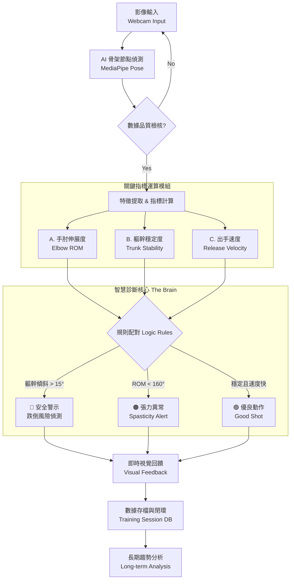

# 專利申請支援文件：地板滾球 AI 智慧分析系統
# Patent Application Support: Boccia AI Analysis System

## 1. 系統流程圖 (System Flowchart)

本系統採集長輩投擲過程的影像數據，經由 MediaPipe 骨架追蹤，即時計算三大關鍵指標，並透過「智慧診斷邏輯 (The Brain)」輸出即時回饋與復健建議。

---

## 2. 關鍵演算法公式 (Key Algorithms)

### A. 手肘伸展度 (Elbow Extension / ROM)
**目的**：量化手臂伸展能力，偵測肌張力異常。
**公式**：計算 Shoulder-Elbow-Wrist 三點夾角。

$$
\theta_{Elbow} = \arccos\left(\frac{AB \cdot BC}{|AB| |BC|}\right) \times \frac{180}{\pi}
$$

*   **節點 (MediaPipe ID)**:
    *   $A$: Right Shoulder (12)
    *   $B$: Right Elbow (14)
    *   $C$: Right Wrist (16)
*   **判斷閾值**:
    *   $\theta < 160^\circ$ : 判定為未完全伸展 (Potential Spasticity)。

### B. 軀幹穩定度 (Trunk Stability)
**目的**：偵測核心肌群無力或身體代償歪斜，預防跌倒。
**公式**：計算左右肩膀連線與水平線之夾角。

$$
\theta_{Trunk} = \left| \arctan\left(\frac{y_{Left} - y_{Right}}{x_{Left} - x_{Right}}\right) \times \frac{180}{\pi} \right|
$$

*   **節點 (MediaPipe ID)**:
    *   $Left$: Left Shoulder (11)
    *   $Right$: Right Shoulder (12)
*   **判斷閾值**:
    *   $\theta > 15^\circ$ : 判定為軀幹不穩 (Instability Alert)。

### C. 出手速度 (Release Velocity)
**目的**：量化肌肉爆發力 (Power)。
**公式**：計算手腕節點在單位時間內的位移量。

$$
V = \frac{\sqrt{(x_t - x_{t-1})^2 + (y_t - y_{t-1})^2}}{\Delta t}
$$

*   **變數**:
    *   $(x_t, y_t)$: 當前幀手腕 (Wrist 16) 座標
    *   $(x_{t-1}, y_{t-1})$: 上一幀手腕座標
    *   $\Delta t$: 幀間隔時間 (Time delta)
