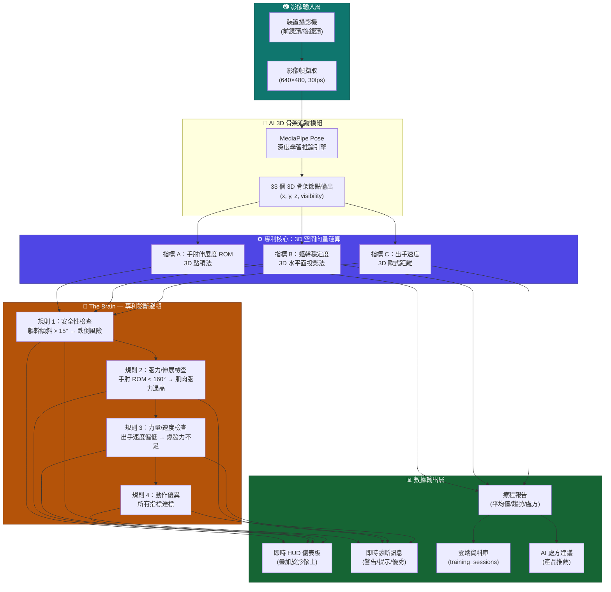
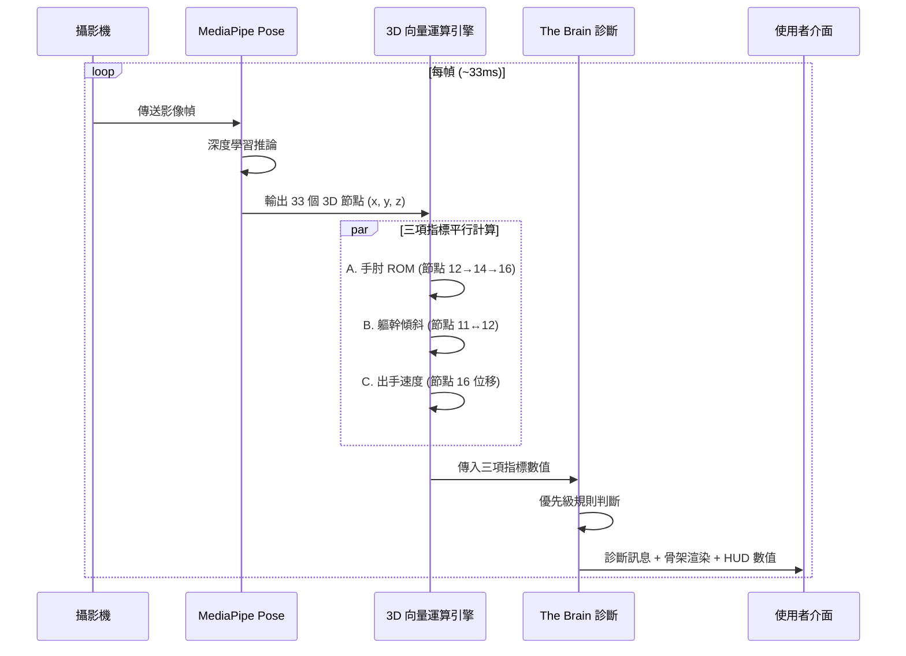
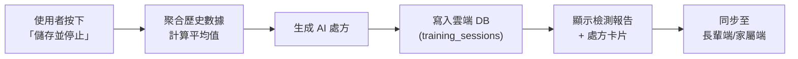

# 系統流程圖 — AI 3D 骨架追蹤復健分析系統

> 本文件供專利事務所撰寫說明書使用

## 系統全局架構

```mermaid
graph TB
    subgraph INPUT["📷 影像輸入層"]
        CAM["裝置攝影機<br/>(前鏡頭/後鏡頭)"]
        FRAME["影像幀擷取<br/>(640×480, 30fps)"]
    end

    subgraph AI_ENGINE["🧠 AI 3D 骨架追蹤模組"]
        MP["MediaPipe Pose<br/>深度學習推論引擎"]
        LM["33 個 3D 骨架節點輸出<br/>(x, y, z, visibility)"]
    end

    subgraph PATENT_CORE["⚙️ 專利核心：3D 空間向量運算"]
        direction TB
        ROM["指標 A：手肘伸展度 ROM<br/>3D 點積法"]
        TRUNK["指標 B：軀幹穩定度<br/>3D 水平面投影法"]
        VEL["指標 C：出手速度<br/>3D 歐式距離"]
    end

    subgraph BRAIN["🧬 The Brain — 專利診斷邏輯"]
        R1["規則 1：安全性檢查<br/>軀幹傾斜 > 15° → 跌倒風險"]
        R2["規則 2：張力/伸展檢查<br/>手肘 ROM < 160° → 肌肉張力過高"]
        R3["規則 3：力量/速度檢查<br/>出手速度偏低 → 爆發力不足"]
        R4["規則 4：動作優異<br/>所有指標達標"]
    end

    subgraph OUTPUT["📊 數據輸出層"]
        RT["即時 HUD 儀表板<br/>(疊加於影像上)"]
        DIAG["即時診斷訊息<br/>(警告/提示/優秀)"]
        REPORT["療程報告<br/>(平均值/趨勢/處方)"]
        DB["雲端資料庫<br/>(training_sessions)"]
        RX["AI 處方建議<br/>(產品推薦)"]
    end

    CAM --> FRAME
    FRAME --> MP
    MP --> LM
    LM --> ROM
    LM --> TRUNK
    LM --> VEL
    ROM --> R1
    TRUNK --> R1
    VEL --> R1
    R1 --> R2 --> R3 --> R4
    R1 & R2 & R3 & R4 --> RT
    R1 & R2 & R3 & R4 --> DIAG
    ROM & TRUNK & VEL --> REPORT
    REPORT --> DB
    REPORT --> RX

    style PATENT_CORE fill:#4F46E5,color:#fff,stroke:#312E81
    style BRAIN fill:#B45309,color:#fff,stroke:#78350F
    style INPUT fill:#0F766E,color:#fff,stroke:#134E4A
    style OUTPUT fill:#166534,color:#fff,stroke:#14532D
```

## 單幀處理流程（30fps 循環）

```mermaid
sequenceDiagram
    participant Camera as 攝影機
    participant MP as MediaPipe Pose
    participant Calc as 3D 向量運算引擎
    participant Brain as The Brain 診斷
    participant UI as 使用者介面

    loop 每幀 (~33ms)
        Camera->>MP: 傳送影像幀
        MP->>MP: 深度學習推論
        MP->>Calc: 輸出 33 個 3D 節點 (x, y, z)
        
        par 三項指標平行計算
            Calc->>Calc: A. 手肘 ROM (節點 12→14→16)
            Calc->>Calc: B. 軀幹傾斜 (節點 11↔12)
            Calc->>Calc: C. 出手速度 (節點 16 位移)
        end

        Calc->>Brain: 傳入三項指標數值
        Brain->>Brain: 優先級規則判斷
        Brain->>UI: 診斷訊息 + 骨架渲染 + HUD 數值
    end
```

## 療程結束流程

```mermaid
flowchart LR
    STOP["使用者按下<br/>「儲存並停止」"] --> AGG["聚合歷史數據<br/>計算平均值"]
    AGG --> RX["生成 AI 處方"]
    RX --> SAVE["寫入雲端 DB<br/>(training_sessions)"]
    SAVE --> SHOW["顯示檢測報告<br/>+ 處方卡片"]
    SHOW --> SYNC["同步至<br/>長輩端/家屬端"]
```
