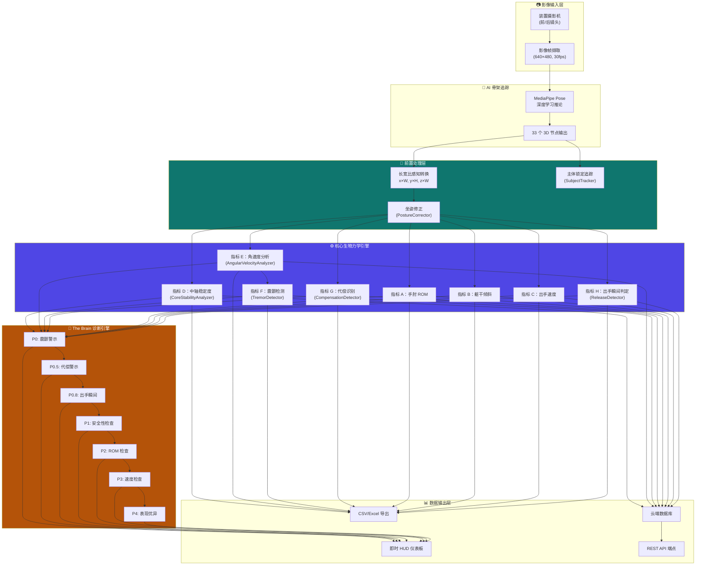

# 技术逻辑白皮书 — AI 3D 骨架追踪动作分析系统（Phase 2）

> 本文件供专利申请与学术合作使用
> 系统版本：Phase 2 — 核心数据指标 + 场域抗干扰强化
> 原始码位置：[biomechanics-engine.ts](file:///c:/Users/secre/.gemini/antigravity/scratch/floor-curling-app/lib/biomechanics-engine.ts)

---

## 一、系统架构总览



---

## 二、前置处理层

### 2.1 长宽比感知座标转换 (Aspect-Ratio Aware Conversion)

> 详见 Phase 1 [patent_algorithm_formulas.md](file:///c:/Users/secre/.gemini/antigravity/scratch/floor-curling-app/docs/patent_algorithm_formulas.md) 第二节

$$
X_{real} = x_{MP} \times W_{image}, \quad Y_{real} = y_{MP} \times H_{image}, \quad Z_{real} = z_{MP} \times W_{image}
$$

### 2.2 主体锁定机制 (Subject Tracking)

#### 技术问题

在日照中心真实环境中，背景常有路人或照护员走动。MediaPipe Pose 默认追踪画面中最显著的人物，可能在帧间跳跃到不同的人。

#### 算法设计

**初始锁定**：系统自动锁定画面中央最大的骨架轮廓。

**帧间追踪**：使用 bounding-box 中心距离 + 面积一致性双重验证：

$$
D_{track} = \sqrt{(x_{center,t} - x_{center,t-1})^2 + (y_{center,t} - y_{center,t-1})^2}
$$

$$
\text{locked} = \begin{cases}
\text{true} & \text{if } D_{track} < 0.5 \times D_{diagonal} \wedge |\frac{A_t - \bar{A}}{\bar{A}}| < 0.4 \\
\text{false} & \text{otherwise}
\end{cases}
$$

**指数移动平均平滑**（α = 0.3）：

$$
x_{locked,t} = (1 - \alpha) \cdot x_{locked,t-1} + \alpha \cdot x_{center,t}
$$

### 2.3 坐姿深度优化 (Posture Correction)

#### A. 驼背检测 (Hunched Posture Detection)

计算耳朵-肩膀连线的前倾角度：

$$
\theta_{hunch} = \arctan\left(\frac{|P_{ear,z} - P_{shoulder,z}|}{|P_{ear,y} - P_{shoulder,y}|}\right) \times \frac{180°}{\pi}
$$

**阈值**：θ_hunch > 20° → 判定为驼背

#### B. 歪斜检测 (Tilted Seat Detection)

左右髋部高度差分析：

$$
\theta_{tilt} = \arctan\left(\frac{|P_{L\_hip,y} - P_{R\_hip,y}|}{\sqrt{(P_{L\_hip,x} - P_{R\_hip,x})^2 + (P_{L\_hip,z} - P_{R\_hip,z})^2}}\right) \times \frac{180°}{\pi}
$$

**阈值**：θ_tilt > 8° → 判定为歪斜

#### C. 坐标系旋转补偿

当检测到歪斜时，以髋部中点为原点进行反向旋转：

$$
\begin{pmatrix} x' \\ y' \end{pmatrix} = \begin{pmatrix} \cos\theta & -\sin\theta \\ \sin\theta & \cos\theta \end{pmatrix} \begin{pmatrix} x - c_x \\ y - c_y \end{pmatrix} + \begin{pmatrix} c_x \\ c_y \end{pmatrix}
$$

---

## 三、核心生物力学指标

### 3.1 既有指标（Phase 1）

| 指标 | 代号 | 计算方法 | 参考文档 |
|------|------|----------|----------|
| 手肘 ROM | A | 3D 点积法（Shoulder→Elbow→Wrist） | `patent_algorithm_formulas.md` §三 |
| 躯干倾斜 | B | 3D 水平面投影法（Left/Right Shoulder） | `patent_algorithm_formulas.md` §四 |
| 出手速度 | C | 3D 欧式距离 + 对角线归一化 | `patent_algorithm_formulas.md` §五 |

### 3.2 指标 D：中轴稳定度 (Core Stability Angle)

#### 目的

量测投球过程中躯干中轴（肩膀中点→髋部中点连线）相对垂直轴的偏移角度，更精确地反映核心肌群控制能力。

#### 使用节点

- $M_{shoulder}$ = 左右肩中点
- $M_{hip}$ = 左右髋中点

#### 数学模型

$$
M_{shoulder} = \frac{P_{L\_shoulder} + P_{R\_shoulder}}{2}
$$

$$
M_{hip} = \frac{P_{L\_hip} + P_{R\_hip}}{2}
$$

躯干向量：
$$
\vec{T} = M_{shoulder} - M_{hip}
$$

垂直参考向量（Y轴向上）：
$$
\vec{V} = (0, -1, 0)
$$

中轴偏移角度：
$$
\theta_{core} = \cos^{-1}\left(\frac{|\vec{T} \cdot \vec{V}|}{|\vec{T}|}\right) \times \frac{180°}{\pi}
$$

#### 临床阈值

| 状态 | 条件 | 临床意义 |
|------|------|----------|
| ✅ 优秀 | θ_core ≤ 5° | 核心肌群控制良好 |
| 🔵 正常 | θ_core ≤ 15° | 安全范围 |
| ⚠️ 高风险 | θ_core > 15° | 核心肌群失能，跌倒风险 |

#### 与指标 B 的区别

| | 指标 B（躯干倾斜） | 指标 D（中轴稳定度） |
|--|--|--|
| **测量对象** | 左右肩连线的倾斜 | 肩膀中点→髋部中点的整体偏移 |
| **捕捉的运动** | 侧向倾斜 | 前后侧向综合偏移 |
| **临床意义** | 侧倒风险 | 核心肌群整体控制 |

---

### 3.3 指标 E：角速度分析 (Angular Velocity Analysis)

#### 目的

实时计算肩、肘、腕三个关节在投球过程中的角速度变化曲线，捕捉动作流畅度与爆发力特征。

#### 数学模型

对每帧分别计算三个关节角度：

| 关节 | 三点定义 |
|------|----------|
| 肩角 | 肘→肩→髋 |
| 肘角 | 肩→肘→腕 |
| 腕角 | 肘→腕→食指 |

角速度（有限差分法）：
$$
\omega_{joint} = \frac{|\theta_t - \theta_{t-1}|}{\Delta t} \quad (°/s)
$$

#### 临床阈值

| 状态 | 条件 | 临床意义 |
|------|------|----------|
| ✅ 爆发力优秀 | ω > 300°/s | 神经肌肉协调良好 |
| 🔵 正常 | 50 ≤ ω ≤ 300°/s | 正常活动范围 |
| ⚠️ 动作迟缓 | ω < 50°/s | 可能早期帕金森/肌少症 |

---

### 3.4 指标 F：震颤检测 (Tremor Detection)

#### 目的

在投球动作的角速度曲线中，自动检测是否存在规律性的高频振荡（震颤）。

#### 数学模型：零交叉法 (Zero-Crossing Method)

在 30 帧滑动窗口（≈ 1 秒 @30fps）内：

**步骤 1**：提取角度一阶差分序列

$$
\delta_i = \theta_i - \theta_{i-1}
$$

**步骤 2**：计算零交叉次数

$$
N_{cross} = \sum_{i=1}^{n-1} \mathbb{1}\left[\text{sign}(\delta_i) \neq \text{sign}(\delta_{i-1})\right]
$$

**步骤 3**：估计震颤频率

$$
f_{tremor} = \frac{N_{cross}}{2 \times T_{window}} \quad (Hz)
$$

**步骤 4**：计算振幅与抗噪过滤

为避免摄影机高频细微噪点（尤其是翻拍螢幕产生的摩尔纹/压缩噪点，通常在 1~2.5° 范围 [4]）引起的假阳性，系统设置了噪点门槛（Noise Threshold, $Th_{noise} = 3.0^\circ$）：
仅当相邻两帧的角度变化量 $|\delta_i| > Th_{noise}$ 时，才将其计入有效动作并计算零交叉。

同时计算有效振幅：
$$
Amplitude = \frac{1}{n-1} \sum_{i=1}^{n-1} |\delta_i|
$$

#### 判定条件

$$
\text{tremor\_positive} = (N_{cross} \geq 8) \wedge (3 \leq f_{tremor} \leq 12 \text{ Hz}) \wedge (Amplitude > 3.0^\circ) \wedge (\text{SignificantRatio} > 0.3)
$$

其中 $\text{SignificantRatio}$ 为有效抖动帧占比（超过噪点门槛的帧间差数量 / 总帧间差数量），此第四重条件确保震颤为持续性而非偶发性。

#### 严重度分级

| 等级 | 交叉次数 | 振幅 | 临床对应 |
|------|---------|------|---------|
| Mild | 8-12 | < 8° | 轻微震颤 |
| Moderate | 12-16 | 8-15° | 中度震颤 |
| Severe | > 16 | > 15° | 严重震颤 |

#### 临床参考

| 颤抖类型 | 频率范围 | 常见疾病 |
|---------|---------|---------|
| 静息震颤 | 3-6 Hz | 帕金森氏症 |
| 动作震颤 | 5-12 Hz | 本态性震颤 (ET) |
| 生理性震颤 | 8-13 Hz | 正常（可忽略） |

---

### 3.5 指标 G：代偿动作识别 (Compensation Detection)

#### 目的

识别长辈因肩部无力而产生的非正常动作模式（代偿惯性），包括甩头、侧身、耸肩三种类型。

#### A. 甩头代偿 (Head Throw)

**检测原理**：投球时头部节点(NOSE) 相对肩膀中点的急剧位移。

$$
D_{head} = \sqrt{(\Delta x_{nose})^2 + (\Delta y_{nose})^2} - \sqrt{(\Delta x_{shoulder\_mid})^2 + (\Delta y_{shoulder\_mid})^2}
$$

**阈值**：$D_{head} > 8\% \times W_{shoulder}$（肩宽的 8%）

#### B. 侧身代偿 (Side Lean)

**检测原理**：髋部中线相对肩膀中线的侧向偏移差异。

$$
\Delta_{lateral} = |M_{shoulder,x} - M_{hip,x}|
$$

**阈值**：$\Delta_{lateral} > 25\% \times W_{shoulder}$（肩宽的 25%）

#### C. 耸肩代偿 (Shoulder Hike)

**检测原理**：投球侧肩膀突然上抬超过非投球侧。

$$
\Delta_{shoulder\_y} = |P_{R\_shoulder,y} - P_{L\_shoulder,y}|
$$

**阈值**：$\Delta_{shoulder\_y} > 20\% \times W_{shoulder}$（肩宽的 20%）

#### 平滑处理

所有代偿检测使用 5 帧滑动窗口平均，避免单帧噪声产生误报。

---

## 四、诊断规则引擎 (The Brain v2)

```
P0:   IF  tremor_ratio > 20%     → 🫨 肢体震颤警示
P0.5: IF  compensation_ratio > 15% → ⚠️ 代偿动作警示
P1:   IF  θ_tilt > 15°           → ⚠️ 核心稳定度不足 (Fall Risk)
P2:   IF  θ_ROM < 160°           → 💪 上肢伸展受限 (Spasticity)
P3:   IF  V < 30                 → ⚡ 发力速度偏慢
P4:   IF  ROM≥160 & V>50         → ✅ 动作表现优异
ELSE:                            → 🔵 动作稳定
```

> 规则按**神经系统 → 代偿模式 → 安全性 → 功能性 → 表现性**的临床优先级排列

---

## 五、数据导出接口规范

### 5.1 REST API

| 端点 | 方法 | 参数 | 描述 |
|------|------|------|------|
| `/api/export/session?id=xxx` | GET | `format=csv\|excel` | 单笔训练导出 |
| `/api/export/session?elderId=xxx` | GET | `from`, `to`, `format` | 批量导出 |

### 5.2 导出格式

#### CSV 逐帧数据（每帧一行 ≈ 30行/秒）

| 栏位 | 类型 | 单位 | 说明 |
|------|------|------|------|
| frame_index | int | - | 帧序号 |
| timestamp_ms | int | ms | 时间戳 |
| elbow_rom_deg | float | ° | 手肘 ROM |
| trunk_stability_deg | float | ° | 躯干倾斜 |
| velocity | float | v | 出手速度 |
| core_stability_angle_deg | float | ° | 中轴偏移 |
| elbow_angular_vel_deg_s | float | °/s | 肘角速度 |
| wrist_angular_vel_deg_s | float | °/s | 腕角速度 |
| is_release_frame | bool | 0/1 | 是否为出手瞬间 |
| tremor_detected | bool | 0/1 | 震颤 |
| tremor_frequency_hz | float | Hz | 震颤频率 |
| compensation_type | string | - | 代偿类型 |
| compensation_severity | int | 0-100 | 代偿严重度 |
| subject_locked | bool | 0/1 | 主体锁定 |
| posture_correction_deg | float | ° | 坐姿修正角度 |

#### Excel 报告

包含两个工作表：
1. **训练摘要** — 所有指标的平均值+状态判定
2. **逐帧数据** — 完整的帧级数据（同 CSV 格式）

### 5.3 编码规范

- CSV 使用 UTF-8 BOM (`\uFEFF`) 确保 Excel 正确识别中文
- Excel 使用 XML Spreadsheet 2003 格式（无外部依赖）

---

### 5.4 AI 處方引擎 (AI Prescription Engine)

系統根據生物力學分析結果，自動產生個人化處方建議。每項處方均有國際指南或同行評審文獻佐證：

| 處方等級 | 觸發條件 | 學術依據 |
|---------|---------|---------|
| 🫨 震顫警示 | tremor_ratio > 20% or tremorFreq > 0 Hz | MDS-UPDRS [R1], MDS Tremor Consensus [R2] |
| ⚠️ 代償動作 | compensation_ratio > 15% | The Janda Approach [R7], ACSM Guidelines [R3] |
| ⚠️ 軀幹不穩 | trunk_stability > 15° | AGS/BGS Falls Prevention [R4], Granacher et al. [R5] |
| 💪 ROM 不足 | elbow_rom < 160° | OARSI Non-Surgical Guidelines [R6], Janda Approach [R7] |
| ⚡ 速度偏低 | velocity < 0.8 m/s | EWGSOP2 Sarcopenia Consensus [R8], ICFSR Frailty [R9], PROT-AGE [R11] |
| ✅ 優異 | 所有指標正常 | ACSM Maintenance Guidelines [R3] |

**AI 處方引擎學術引用清單**：

| 編號 | 引用 |
|-----|-----|
| R1 | Goetz CG et al. (2008). MDS-UPDRS: Clinimetric Properties. *Mov Disord*, 23(15), 2129-2170. |
| R2 | Deuschl G et al. (1998). Consensus Statement of the MDS on Tremor. *Mov Disord*, 13(S3), 2-23. |
| R3 | ACSM (2018). *Guidelines for Exercise Testing and Prescription*, 10th Ed. Wolters Kluwer. |
| R4 | AGS/BGS (2011). Clinical Practice Guideline for Prevention of Falls in Older Persons. *JAGS*, 59(1), 148-157. |
| R5 | Granacher U et al. (2013). Trunk Muscle Strength for Balance and Fall Prevention in Seniors. *Sports Med*, 43(7), 627-641. |
| R6 | OARSI (2019). Guidelines for Non-Surgical Management of OA. *Osteoarthritis Cart*, 27(11), 1578-1589. |
| R7 | Page P et al. (2010). *Assessment and Treatment of Muscle Imbalance: The Janda Approach*. Human Kinetics. |
| R8 | Cruz-Jentoft AJ et al. (2019). Sarcopenia: Revised European Consensus (EWGSOP2). *Age Ageing*, 48(1), 16-31. |
| R9 | Dent E et al. (2019). Physical Frailty: ICFSR International Clinical Practice Guidelines. *JNHA*, 23(9), 771-787. |
| R10 | Lozano-Montoya I et al. (2017). Non-pharmacological Interventions for Frailty and Sarcopenia. *JAMDA*, 18(9), 780-786. |
| R11 | Bauer J et al. (2013). Optimal Dietary Protein in Older People: PROT-AGE Position Paper. *JAMDA*, 14(8), 542-559. |

---


| 干扰类型 | 解决方案 | 算法核心 | 预期效果 |
|---------|---------|---------|---------|
| 背景行人 | 主体锁定 (SubjectTracker) | BBox 距离 + 面积一致性 | 单目标稳定追踪 |
| 驼背坐姿 | 姿势修正 (PostureCorrector) | 耳肩前倾角检测 | θ_hunch > 20° 时标记 |
| 歪斜椅子 | 坐标旋转补偿 | 髋部倾斜角反向旋转 | 消除坐姿对指标的影响 |
| 镜头角度 | 3D 空间向量运算 | Phase 1 已实现 | 排除视角干擾 |
| 画面比例 | 长宽比感知转换 | Phase 1 已实现 | 消除直式/横式差异 |

---

## 七、性能指标

| 项目 | 规格 |
|------|------|
| 处理帧率 | ≥ 25 fps (目标 30 fps) |
| 端到端延迟 | < 100ms |
| 模型复杂度 | MediaPipe Pose Lite/Full (可配) |
| 最低可见节点数 | 5 个（低于则标记锁定丢失）|
| 浏览器兼容 | Chrome 90+, Safari 15+, Edge 90+ |
| 设备要求 | 支持 WebGL 的任何设备 |

---

## 八、安全降级机制

```
节点不可见  → z = 0 自动降级为 2D 计算
主体丢失    → 标记 subjectLocked = false，暂停数据记录
震颤误报    → 需连续 45 帧（1.5秒）以上 + 四重条件方确认 [3][4]
驼背/歪斜   → 仅标记不强制修正，原始数据同步保留
```

---

> **版本历史**
> - Phase 1 (v1.0): 手肘 ROM + 躯干倾斜 + 出手速度 + 长宽比感知
> - Phase 2 (v2.0): 中轴稳定度 + 角速度 + 震颤检测 + 代偿识别 + 主体锁定 + 坐姿修正 + 防伪出手判定 + CSV/Excel 导出

---

## 九、参考文献 (References)

[1] Winter, D. A. (2009). *Biomechanics and Motor Control of Human Movement* (4th ed.). Wiley. — 推荐四阶 Butterworth 低通滤波器用于运动学数据处理。

[2] Robertson, D. G. E., et al. (2013). *Research Methods in Biomechanics* (2nd ed.). Human Kinetics. — 零相位 filtfilt 双向滤波方法论。

[3] Deuschl, G., Bain, P., & Brin, M. (1998). Consensus statement of the MDS on Tremor. *Movement Disorders*, 13(S3), 2-23. — 震颤频段分类共识。

[4] Elble, R. J. (2003). Characteristics of physiologic tremor. *Clinical Neurophysiology*, 114(4), 624-635. — 生理性微颤振幅特征。

[5] Wu, G., et al. (2005). ISB recommendation on joint coordinate systems. *J. Biomechanics*, 38(5), 981-992. — 3D 关节角度 ISB 标准。

[6] Welch, G., & Bishop, G. (2006). An Introduction to the Kalman Filter. UNC TR 95-041. — 离散 Kalman Filter 框架。

[7] Stenum, J., et al. (2021). Video-based gait analysis using pose estimation. *PLOS Comp. Biol.*, 17(4). — 无标记动捕 MAE < 5° 临床可接受标准。

[8] Bazarevsky, V., et al. (2020). BlazePose: On-device Real-time Body Pose tracking. *CVPR Workshop*. — MediaPipe Pose 原始论文。

[9] Heldman, D. A., et al. (2011). Essential tremor quantification. *Parkinsonism & Related Disorders*, 17(7). — 零交叉法震颤频率定量。

[10] Colyer, S. L., et al. (2018). Validity of the Kinect for joint angles. *BMC Musculoskelet. Disord.*, 19(1). — 消费级感测器关节角度效度。

